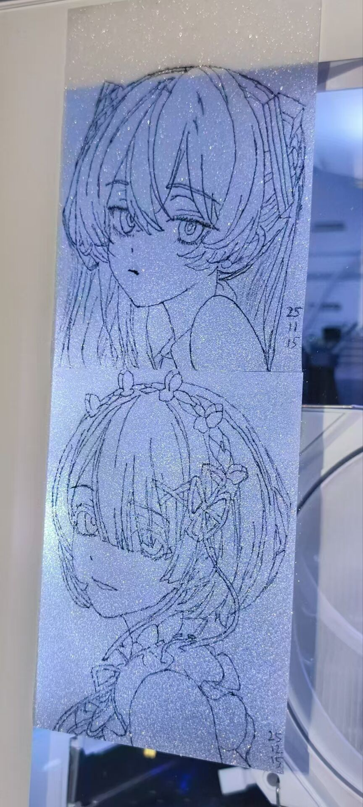

「初始之音 响彻未来」

---
# Member - XFJ (Minecraft雪峰君)

也是加入SiiWay啦！！！

ps.我实在想不到我有什么个人介绍（哭

冷知识：《Minecraft》是我小时候第一个让我无比着迷的游戏，所以我的网名里有“Minecraft”，但是不排除以后会改掉网名（别人说这个名太xxs了）

## Hobby

刷机、装电脑、NAS、软路由、DIY.......

大概啥都玩点？

其实好像是做Magisk模块起家的（emmm？？

我也贴个画的画？？（喵喵喵

其实是UP主 @栩生难 的草稿啦（不过我稍微改了改？

## Language
可能掌握的语言

- Scratch ！！！（bushi

在学的语言

- Python

呜呜我应该是全SiiWay最笨的人了（哭

## Projects

我都说了我是全SiiWay里最笨的人了，还想有项目？？！

ps.在写了在写了，可以进我 Github 主页监工？（雾

## Contact

个人主页（求求加个群吧，都臭了（悲 ）: [XFJの主页](https://minecraftxfj.top)

CoolAPK: [Minecraft雪峰君](https://www.coolapk.com/u/2998178)

GitHub: [XFJ-YYQF](https://github.com/XFJ-YYQF)

BiliBili: [Minecraft雪峰君](https://space.bilibili.com/518725775)

